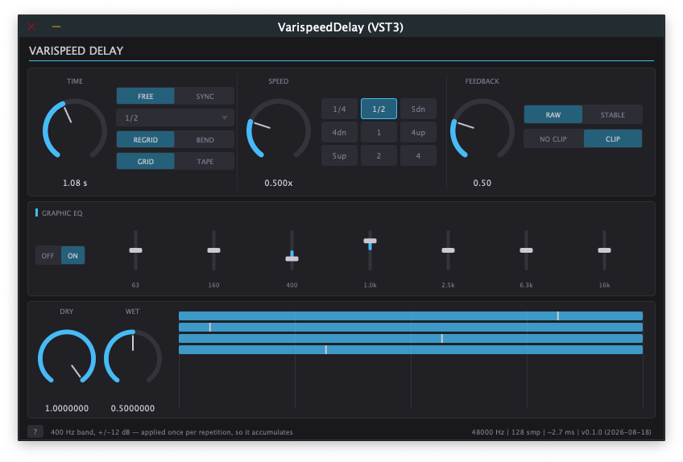

# Varispeed Delay

[](https://github.com/silvansky/VarispeedDelay/actions/workflows/build.yml)
[](https://www.kvraudio.com/product/varispeeddelay-by-valentine-silvansky)

JUCE audio plugin (VST3 / AU / Standalone): a delay where every repetition is replayed at
a different tape speed — pitch and duration change together.



[Demo video](https://youtu.be/MTJbedOc2To)

- time knob, free (0.1 ms – 20 s, floored at the audio buffer) or tempo-synced (up to 2 bars),
  with tap tempo and a ring showing where each note division falls at the current tempo
- speed knob 1/4x – 4x, with a 3x3 shortcut grid: octaves plus fourths and fifths
- feedback 0–2, raw (cumulative varispeed) or stable (one-shot varispeed) recycling
- 7-band graphic EQ in the repetition path, ±12 dB, bypassable
- separate dry and wet levels
- slow repetitions overlap the following ones, never cut off at the period boundary
- time mode switch: regrid the tail on a time change, or bend it like tape
- spacing switch: keep repetitions on the grid, or let them run away like a tape loop
- PPQ-anchored sync, so a bounce matches what was auditioned from any start point
- short crossfades at repetition edges and at the input/recycle join for click protection
- soft clip in the recycle path with an adjustable threshold, −36 to −1 dBFS; the knob's
  arc turns red while it is actually working
- loop-gain readout — feedback times the largest EQ boost, since that boost compounds too —
  so the point where the tail stops decaying is visible rather than guessed
- resizable UI: pick a zoom or drag the corner; every value can be typed, shift-drag is
  fine control, double-click resets, and hovering anything explains it in the footer

## Build

JUCE comes in as a submodule, so clone recursively:

```bash
git clone --recurse-submodules https://github.com/silvansky/VarispeedDelay.git
cd VarispeedDelay && mkdir -p build && cd build
cmake .. -DCMAKE_BUILD_TYPE=Release && cmake --build . -j8
ctest --output-on-failure          # engine + preset/parameter unit tests
```

Artefacts land in `build/VarispeedDelay_artefacts/Release/{Standalone,AU,VST3}/`.
`./install-au.sh` signs the AU, installs it to `~/Library/Audio/Plug-Ins/Components` and
runs `auval`; `--system` installs to `/Library` instead and asks for sudo.

CI builds and tests every push on macOS (universal, arm64 + x86_64) and Windows, and
pushing a `v*` tag attaches the zipped VST3 / AU / Standalone builds to a release.
Prebuilt binaries are on the [releases page](https://github.com/silvansky/VarispeedDelay/releases).

## Tested hosts

| Platform | Host | Format |
|---|---|---|
| macOS | Logic Pro | AU |
| Windows | FL Studio | VST3 |
| Windows | Ableton Live | VST3 |

## Docs

| File | What it covers |
|---|---|
| `USAGE.md` | what every control does, and the behaviours that are deliberate rather than bugs |
| `STYLE.md` | the UI style guide: canvas, palette, type, knob and chip anatomy, interaction rules |
| `plan.md` | the design: generation/voice model, feedback topologies, fades, sync, phases |
| `CLAUDE.md` | build commands, conventions, and the engine invariants to know before changing it |

## Licence

This project uses JUCE under the **AGPLv3**, so any plugin binary built from this
repository is a combined work covered by the AGPLv3 — see `LICENSE`. Distributing such a
binary means making the complete corresponding source available to its recipients.

The code written for this project (`src/`, `tests/`, the CMake files) is additionally
offered under the **MIT License** (`LICENSE-MIT`) when used independently of JUCE, so the
delay engine and EQ can be reused freely. `COPYRIGHT.md` spells this out.

## Status

Engine, UI, sync, EQ and preset machinery are implemented; all three formats build
warning-free and the unit tests pass. The AU passes `auval` and runs in Logic Pro; the
VST3 runs in FL Studio and Ableton Live on Windows.

Outstanding: factory preset *content* (the mechanism is done, but presets have to be
dialled in by ear in the standalone), a pluginval run, and the by-ear tuning of glide,
bend limits, clip threshold and interpolation order.
